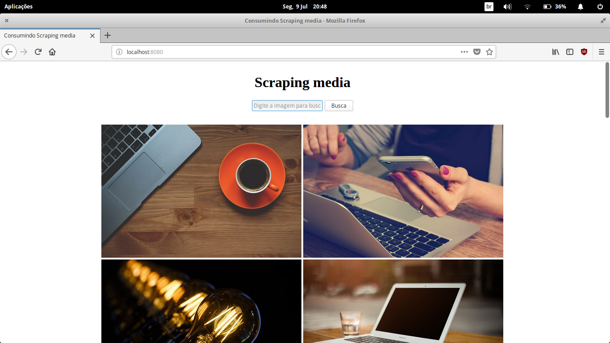

# Scraping media

O *Scraping Media* é um simples projetos de consulta de imagens do pixaby. Utilizando técnicas de raspagem de dados
em Go e tecnologias front-end na ponta como Ajax.



## Para iniciar

1. Ative o servidor que irá fazer o scraping do recurso desejado
```bash
    go run server.go
```

2. Rode o index.html em um servidor estático como o http-server do NodeJS
```bash
    http-server . -c-1
```
